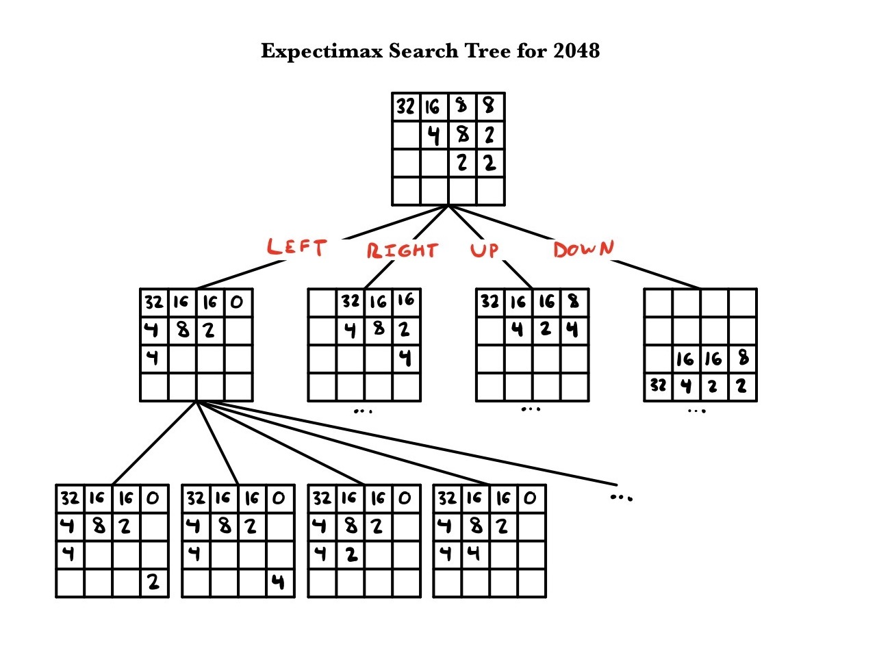

# 2048-bot
AI bot written in Python that can play 2048 both locally and in the browser

## Running
### Local (command line) version
```
python3 play2048.py
```

### Browser version
To run the bot in the browser, open www.play2048.co in your browser and update x_coords and y_coords in tiles.py with the pixel indices for each row and column of the game. A more robust system will be coming in the future.
Then, run play2048.py in the command line with the browser window fully visible:
```
python3 play2048.py --mode=browser
```

## Performance
In its default configuration, the AI can achieve the 2048 tile __ percent of the time.
Here are the proportions of games which ended with the specific tile as the highest value:
Highest Tile | Percentage of Games
------------ | -------------------
256 | 2%
512 | 6%
1024 | 33%
2048 | 46%
4096 | 12%

## Implementation

My implementation uses the Expectimax algorithm which is used to maximize the chances of winning for a player assuming that the opponent does not play optimally. In the case of 2048, the player is the user playing the game and the opponent is the computer that randomly generates a tile of size 2 or 4 and places it on an empty spot on the board after the user makes a move. More about expectimax trees can be found [here](https://www.geeksforgeeks.org/expectimax-algorithm-in-game-theory/).

To decide which move to make, all 4 moves are simulated from the current board position. From each one of the 4 new board states all possible random tile generations are tried. A score is assigned to each one of these resultant states and the average score is taken from all. This results in an average score for each move: left, right, up, and down. Finally, the maximum is taken of the averages and the move with the highest average resultant score is returned

## Scoring
In order to determine the score of any particular board, I used the heuristic that the highest tile should always be in the corner of the board and the rest of tiles should follow in a "snake" pattern in decreasing order.


To do this I simply multiplied the board elementwise with a scoring table that is made up of 1/(2^0) ... 1/(2^15)

While this heuristic alone was good enough to beat the game 46% of time, the algorithm can be improved by looking at other factors as well such as number of empty blocks and number of blocks that can be merged.

## Acknowledgements
A lot of inspiration for this method came from nneonneo's reponse to [this](https://stackoverflow.com/questions/22342854/what-is-the-optimal-algorithm-for-the-game-2048) stack overflow posting on 2048
